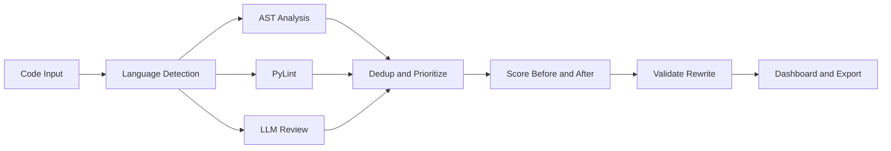

# NeuroCode


NeuroCode is a hackathon-ready AI code review workspace built with Streamlit. It combines rule-based analysis, Python linting, and Hugging Face powered semantic review to turn raw code into a structured engineering report with prioritized issues, before/after comparison, validation, and exportable output.

## Elevator Pitch

NeuroCode helps developers move from raw code to a judge-friendly engineering review in seconds. Instead of returning noisy lint logs or generic AI feedback, it runs a staged review pipeline, prioritizes the most important issues, validates rewrites, and packages the result into a polished dashboard with exportable output.

## Why NeuroCode

- Reviews code from multiple entry points: snippet, uploaded files, local folders, and GitHub repositories
- Performs deep Python-specific checks with AST analysis and PyLint
- Uses Hugging Face for semantic review and safer rewrite suggestions
- Ranks and deduplicates findings so the highest-risk issues surface first
- Validates rewrites and compares quality before and after
- Packages everything in a polished dashboard with tabs for overview, issues, comparison, timeline, and export

## What It Reviews

### Deep local review

- Python

Python gets the strongest path in NeuroCode:

- AST-based bug and security heuristics
- PyLint integration
- issue deduplication and prioritization
- rewrite validation and rescoring

### Model-assisted review

- JavaScript
- TypeScript
- Java
- C
- C++
- C#
- Go
- Ruby
- PHP
- Rust
- Swift
- Kotlin
- Scala
- HTML
- CSS
- SQL
- JSON
- YAML
- Shell

Non-Python files still get semantic review and rewrite suggestions when Hugging Face is configured.

## Review Pipeline

NeuroCode follows a staged review pipeline:

1. Intake source code from a snippet, file upload, folder, or GitHub repo
2. Detect language and route Python into the deeper local analysis path
3. Run AST heuristics and PyLint where applicable
4. Call the Hugging Face model for semantic review and improved code
5. Merge, deduplicate, and prioritize findings
6. Score the original and rewritten versions
7. Validate the rewrite
8. Present results in a dashboard and exportable report

## Architecture



## Key Features

- Multi-source intake
- Multi-language review
- Python-first static analysis
- Hugging Face semantic review
- Before/after code comparison
- Agent workflow timeline
- Quality scoring and validation
- Markdown and HTML export
- Built-in demo snippets for fast judging flow
- Light and dark UI modes

## Screens and UX

NeuroCode is organized around a clean review flow:

- intake for snippet, upload, folder, or GitHub source selection
- overview tab for summary metrics and severity counts
- issues tab for prioritized findings with provenance
- before/after tab for rewrite comparison
- timeline tab for pipeline explainability
- export tab for report download

## Tech Stack

- Streamlit
- Python
- Hugging Face Inference Providers
- PyLint

Default model:

- `meta-llama/Llama-3.1-8B-Instruct:novita`

## Project Structure

```text
code_reviewer_ai/
├─ hackathon_app.py
├─ reviewer_engine.py
├─ hackathon_utils.py
├─ tests/
├─ requirements.txt
├─ .env.example
└─ README.md
```

## Quick Start

### 1. Install dependencies

```powershell
python -m pip install -r requirements.txt
```

### 2. Configure Hugging Face (optional but recommended)

You can either set environment variables in PowerShell:

```powershell
$env:HF_TOKEN="your-hugging-face-token"
$env:HF_MODEL="meta-llama/Llama-3.1-8B-Instruct:novita"
$env:HF_API_BASE="https://router.huggingface.co/v1"

```

Or create a local `.env` file in the project root:

```env
HF_TOKEN=your-hugging-face-token
HF_MODEL=meta-llama/Llama-3.1-8B-Instruct:novita
HF_API_BASE=https://router.huggingface.co/v1
HF_ENDPOINT_URL=
```

If no token is set, NeuroCode still works with local static analysis only.

### 3. Run the app

```powershell
python -m streamlit run hackathon_app.py
```

## Hugging Face Notes

- `HF_MODEL` uses a Hub model ID through Hugging Face Inference Providers
- if you have a dedicated Hugging Face Inference Endpoint, set `HF_ENDPOINT_URL`
- if you see a `403` mentioning `Inference Providers`, the token is present but cannot call the routed provider API

In that case:

- use a token with Inference Providers permission, or
- configure a dedicated Hugging Face endpoint in `HF_ENDPOINT_URL`

## Demo Flow

For a strong hackathon demo:

1. Choose `Code snippet` mode
2. Load one of the built-in broken demo snippets
3. Run NeuroCode review
4. Walk through the overview metrics and top findings
5. Open the before/after comparison
6. Show the timeline to explain the pipeline
7. Export the report

## Why It Stands Out

- combines static analysis and model reasoning instead of relying on one or the other
- gives Python deeper local analysis while still supporting mixed-language projects
- emphasizes prioritized findings over raw output noise
- includes explainable workflow steps for judges and reviewers
- creates a report artifact that can be shared after the demo

## Testing

Run the test suite with:

```powershell
python -m pytest
```

## Submission Notes

NeuroCode is designed to show both technical depth and product polish:

- local static analysis for credibility
- model-assisted reasoning for broader language support
- prioritized findings instead of noisy output
- exportable review artifacts for judges and teammates


